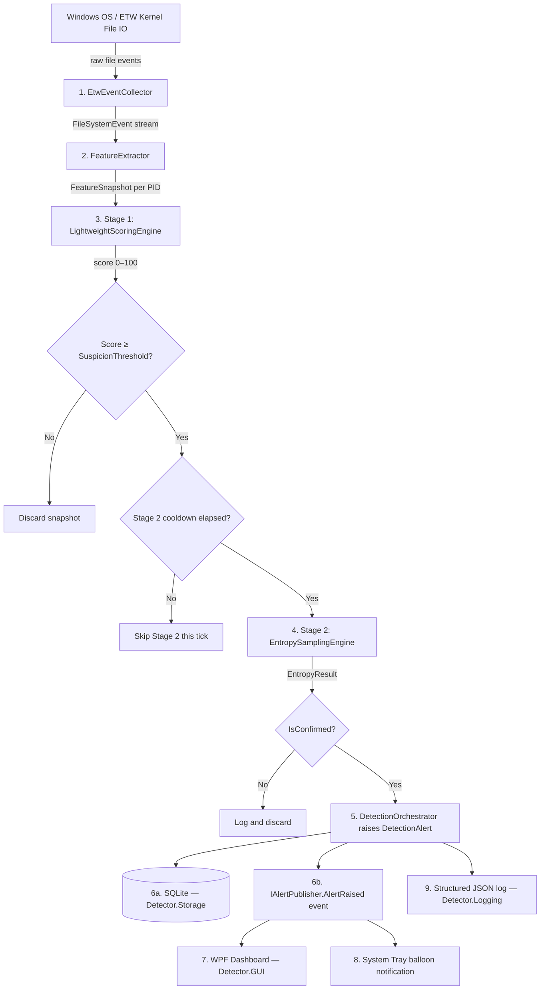

# ActDefend System Architecture

ActDefend is a lightweight behavioural ransomware detection system for Windows desktops. It operates entirely in user space using Event Tracing for Windows (ETW) and requires no kernel drivers.

## High-Level Pipeline

Detection is a strictly sequential, two-stage pipeline. Low-cost behavioural scoring runs on every emit tick; expensive entropy I/O runs only when Stage 1 raises suspicion.



## Architectural Components

### 1. EtwEventCollector (`Detector.Collector`)
- Opens a named ETW kernel session (`ActDefend-Monitor-Session`) using `Microsoft.Diagnostics.Tracing.TraceEvent`.
- Subscribes to `FileIOCreate`, `FileIOWrite`, `FileIORead`, `FileIORename`, `FileIODelete` kernel events.
- Normalises each event into a `FileSystemEvent` record (PID, process name, file path, event type, timestamp).
- Filters obvious noise: PIDs ≤ 4, paths under `C:\Windows\`, and `.TMP`-suffixed paths.
- Pushes events into a bounded `System.Threading.Channel<FileSystemEvent>` (capacity 8 192, `DropWrite` on full).
- Resolves PID → process name via a lazy `ConcurrentDictionary` cache (capped at 5 000 entries).
- Requires **Administrator elevation**. Propagates `UnauthorizedAccessException` if run unprivileged.

### 2. FeatureExtractor (`Detector.Features`)
- Maintains a `ConcurrentDictionary<int, ProcessState>` — one entry per active PID.
- Each `ProcessState` accumulates `FileSystemEvent`s in a list (bounded by the context window) and separately tracks newly-created file paths in a capped `HashSet<string>`.
- On each orchestration tick, `Emit()` produces a `FeatureSnapshot` per PID with six metrics computed over a configurable 5-second primary window (see [modules/FeatureExtractor.md](modules/FeatureExtractor.md)).
- `ExpireInactiveState()` removes PIDs silent for more than `InactivityExpirySeconds` (default 120 s).

### 3. LightweightScoringEngine — Stage 1 (`Detector.Detection`)
- Scores each `FeatureSnapshot` on a 0–100 scale using six weighted, normalised features.
- Any score ≥ `SuspicionThreshold` (default 60.0) is flagged as suspicious.
- Produces `ScoringResult` with a human-readable explanation identifying the top-3 contributing features.
- All weights and normalisation thresholds are configurable in `appsettings.json`.

### 4. EntropySamplingEngine — Stage 2 (`Detector.Entropy`)
- Triggered only when Stage 1 scores a process as suspicious and the per-process cooldown has elapsed.
- Builds a candidate file list by merging `RecentWrittenFiles` and `RecentRenamedSourceFiles` from the snapshot.
- For each candidate, probes the original path; if not readable, attempts common ransomware extensions (`.locked`, `.encrypted`, `.enc`, `.crypto`, `.crypted`).
- Reads up to `SampleBytesLimit` (default 64 KiB) per file and computes Shannon entropy.
- Skips files with known high-entropy-but-benign extensions (`.dll`, `.exe`, `.zip`, `.png`, etc.) to avoid false positives from compilers and installers.
- Confirms detection when ≥ `ConfirmationMinFiles` (default 2) files exceed `EntropyThreshold` (default 7.2 bits/byte).

### 5. DetectionOrchestrator (`Detector.Detection`)
- The central coordinator; contains no detection logic itself.
- On each tick: calls `FeatureExtractor.Emit()` → scores each snapshot → calls Stage 2 where needed → builds `DetectionAlert` → calls `IAlertRepository.SaveAsync()` + `IAlertPublisher.Publish()`.

### 6. Storage Layer (`Detector.Storage`)
- **`AlertRepository`**: Persists `DetectionAlert` objects to a local SQLite database (`actdefend.db`) using `Microsoft.Data.Sqlite` directly (no ORM). Uses WAL mode and a `Lock` for thread safety. Alerts survive application restarts.
- **`AlertPublisher`**: In-process event (`EventHandler<DetectionAlert>`) that notifies the GUI immediately when an alert is raised.
- **`TrustedProcessRepository`**: Loads default exclusions from `appsettings.json` into memory at startup. Runtime additions are held in memory only and **not persisted** to SQLite — they are reset on restart.

### 7 & 8. GUI + Tray (`Detector.GUI`)
- WPF application hosted by `WpfHostedService` on a dedicated STA thread, integrated with the .NET Generic Host lifetime.
- `MainWindowViewModel` subscribes to `IMonitoringStatus.StatusChanged` and `IAlertPublisher.AlertRaised` and bridges them to WPF data-binding via the Dispatcher.
- A `DispatcherTimer` (3-second interval) refreshes high-frequency live counters independently.
- Closing the window hides it to tray; double-clicking the tray icon restores the window. The monitoring pipeline continues uninterrupted.

### 9. Logging (`Detector.Logging`)
- Wraps Serilog with two sinks: console (human-readable text) and rolling JSON file (`logs/actdefend-<date>.json`).
- A bootstrap logger captures elevation-check messages before the host is built.

## Dependency and Layering

```
Detector.Core       — interfaces + models + configuration (no dependencies on other projects)
     ▲
     │ (references)
Detector.Collector  ──┐
Detector.Features   ──┤
Detector.Detection  ──┤─▶ Detector.App  ── Detector.GUI
Detector.Entropy    ──┤
Detector.Storage    ──┘
Detector.Logging    ──┘
```

`Detector.App` is the composition root. All cross-cutting dependencies are resolved via `IServiceProvider`; no project holds a direct reference to another outside this graph.

## Key Design Decisions

### No Kernel Driver
ETW (user-space) provides sufficient file-I/O telemetry without the complexity or end-user friction of a Mini-Filter driver.

### Two-Stage Filtering
Cheap behavioural scoring on every tick keeps CPU overhead near zero. Expensive entropy I/O only fires when Stage 1 is already confident, and a per-process cooldown (default 10 s) prevents repeated sampling.

### Backpressure — Drop vs Block
The bounded channel uses `DropWrite` mode. Under extreme event velocity the collector drops events (counter available in UI) rather than blocking the ETW callback thread or growing unboundedly.

### Explainability Over Black Box
Every alert carries a `ScoringResult.Explanation` (top-3 contributing features) and an `EntropyResult.Explanation` (files sampled, entropy values, confirmation count). This makes every detection traceable without reviewing logs.

### Configuration Without Recompilation
Every threshold, weight, window size, and sampling parameter lives in `appsettings.json`. Changing detection sensitivity requires only editing the file and restarting the application.
