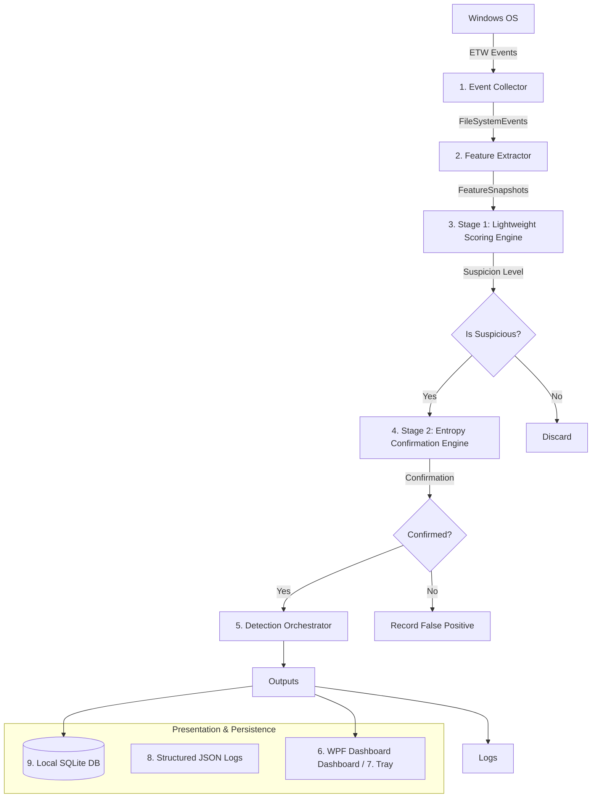

# ActDefend System Architecture

ActDefend is a lightweight behavioural ransomware detection system designed for Windows desktop environments. It operates exclusively in user space, leveraging Event Tracing for Windows (ETW) to detect ransomware-like file activity at an early stage.

## High-Level Pipeline

The pipeline is strictly sequential and relies on a multi-stage approach, where low-cost telemetry aggregation precedes heavier analytical checks.

## Architectural Components

1. **Event Collector (`Detector.Collector`)**
   - Normalizes raw `Microsoft-Windows-Kernel-File` ETW payloads into structured `FileSystemEvent` objects.
   - Provides backpressure safety using in-memory bounded channels (`Channel<FileSystemEvent>`).
   - Resolves PID to Process Names.
   - *Architecture Note:* Requires Administrator elevation.
2. **Feature Extractor (`Detector.Features`)**
   - Maintains transient state and aggregates individual file events into process-aware `FeatureSnapshot` groupings based on configurable sliding time windows.
3. **Stage 1 Lightweight Scoring Engine (`Detector.Detection`)**
   - Continuously evaluates `FeatureSnapshot` objects to generate explainable low-latency suspicion scores (e.g. write rates, traversals).
4. **Stage 2 Entropy Confirmation Engine (`Detector.Entropy`)**
   - Triggers *only* if Stage 1 signals a process as highly suspicious.
   - Performs a bounded file sample entropy calculation to verify if file payloads strongly suggest encryption.
5. **Detection Orchestrator (`Detector.Detection`)**
   - The authoritative core component tying the pipeline together. Routes the results of the Feature Extractor into Stage 1, evaluates triggers for Stage 2, and handles alert generation.
6. **GUI Dashboard (`Detector.GUI`)**
   - A lightweight WPF interface operating independent of the core logic processing, visually depicting monitoring state and pipeline health via generic interface boundaries (`IMonitoringStatus`).
7. **Tray Integration (`Detector.GUI`)**
   - Windows notification area support for quiet background monitoring presence.
8. **Local Logging (`Detector.Logging`)**
   - Machine-friendly and debug-oriented contextual JSON logging (powered by `Serilog`).
9. **Local Database (`Detector.Storage`)**
   - Durable history of alerts and trusted rules (powered by SQLite). *Note: Currently mocked with in-memory persistence during Phase 1/2 development.*
10. **Safe Ransomware Simulator (`Detector.Simulator`)**
    - Isolated tool for generating controlled telemetry (file creations, renames) to evaluate the pipeline without resorting to actual malware testing.
11. **Configuration Management (`Detector.Core`)**
    - Centralized tunable boundaries (thresholds, timings, weights) loaded from `appsettings.json`.
12. **Documentation Set (`docs/`)**
    - The repository of truth for current state and architectural specifications.
13. **Tests (`tests/`)**
    - Safety netting spanning pure Unit verification through Elevated integration runs.

## Practical Dev Adjustments / Implementation Notes
- **Elevation Requirement Matrix:** ETW File session demands Administrator privileges (`NT Kernel Logger` style ETW does; however, `TraceEventSession` targeting File I/O explicitly requires elevation regardless of User Mode vs Kernel Mode source). For user experience, the GUI app attempts automatic UAC self-reboot. 
- **Storage Strategy:** SQLite is the eventual target, but to enable parallelizing pipeline development, the current `Detector.Storage` layer injects interface-contract-abiding In-Memory concurrent dictionaries.
- **Dependency Inversion:** Features, Orchestration, Entropy, Storage, GUI, and Logging represent strictly layered, abstracted domains. `Detector.App` is the central composer, resolving these together into a standard .NET 10 Background Service flow.
